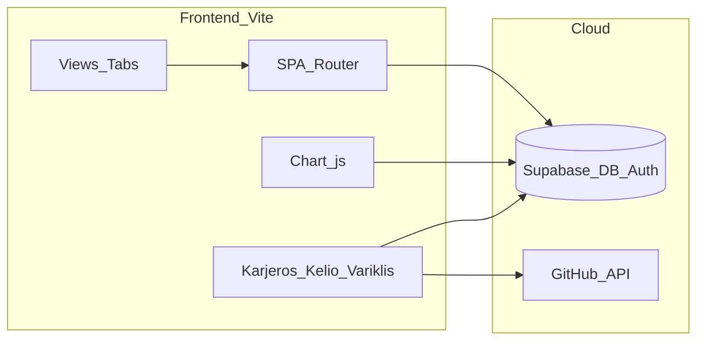
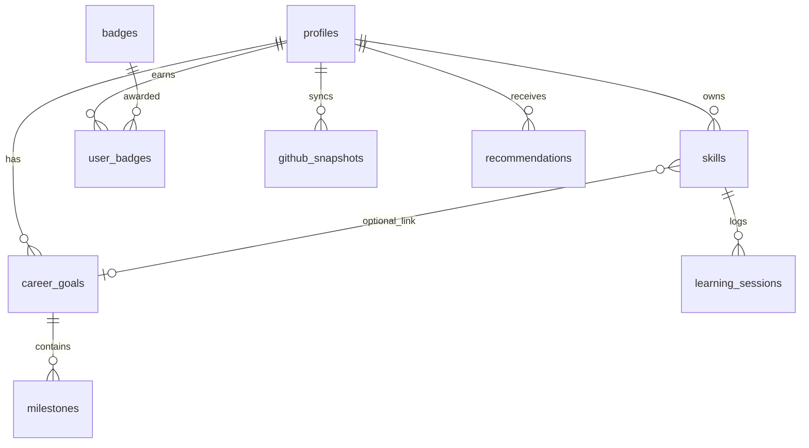
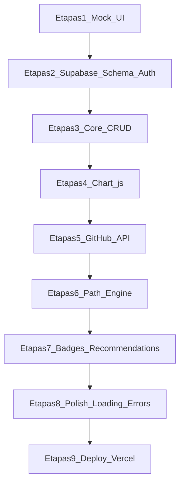

# SkillForge AI – Architektūros planas

> Išsaugota projekto dokumentacija. Paskutinis atnaujinimas: 2026-06-08.

## Progresas

- [x] Etapas 1: Mock UI (Vite, 6 tabs, mock-data, Chart.js Analitika puslapyje)
- [ ] Etapas 2: Supabase schema (8 lentelės + RLS), Auth, .env
- [ ] Etapas 3: Skills, sessions, goals CRUD – visas state į DB
- [ ] Etapas 4–5: Realūs grafikai iš DB + GitHub API integracija
- [ ] Etapas 6: Karjeros Kelio Variklis (path-engine.js) + recommendations
- [ ] Etapas 7–9: Badges, loading/errors polish, Vercel deploy

---

## 1. Projekto aprašymas

**SkillForge AI** – asmeninė karjeros ir įgūdžių mokymosi sistema. Vartotojas nustato karjeros tikslą, registruoja mokomus įgūdžius ir mokymosi sesijas, stebi progresą grafikuose ir gauna personalizuotas rekomendacijas, paremtas jo istorija + GitHub aktyvumu.

**Stack:** Vite + Vanilla JS/HTML/CSS · Supabase (Auth + PostgreSQL) · Chart.js · GitHub REST API · Vercel/Netlify deploy.



---

## 2. Pagrindinės funkcijos

| Funkcija | Aprašymas |
|----------|-----------|
| Autentifikacija | Registracija / prisijungimas per Supabase Auth |
| Karjeros tikslai | Sukurti, redaguoti, sekti tikslų progresą |
| Įgūdžių valdymas | Pridėti įgūdžius, lygiai (1–5), kategorijos |
| Mokymosi sesijos | Registruoti trukmę, datą, pastabas – su laiko žymomis |
| Analitika | 3+ interaktyvūs grafikai iš realių DB duomenų |
| GitHub sinchronizacija | GitHub username → kalbos, repozitorijos, aktyvumas |
| Rekomendacijos | Kas mokytis toliau – pagal spragas ir GitHub duomenis |
| Gamifikacija | Ženkleliai (badges) už pasiekimus |
| Karūnos Brangakmenis | **Karjeros Kelio Variklis** – sudėtinga kelio generavimo logika |

---

## 3. Puslapiai / Tabs (6 views)

| Tab | Paskirtis |
|-----|-----------|
| **Dashboard** | Santrauka: savaitės valandos, streak, aktyvūs įgūdžiai, paskutinės sesijos, greitos rekomendacijos (be grafikų) |
| **Įgūdžiai** | CRUD įgūdžiams, lygiai, kategorijos |
| **Sesijos** | Mokymosi sesijų registravimas ir istorija su laiko žymomis |
| **Analitika** | 3 pagrindiniai Chart.js grafikai (laikas, proporcijos, progresas) |
| **Karjeros kelias** | Karjeros Kelio Variklis – tikslai, milestone'ai, rekomenduojamas kelias |
| **Profilis** | Nustatymai, GitHub username, badges, atsijungimas |

Navigacija: SPA su hash router (`#/dashboard`, `#/skills`, `#/sessions`, `#/analytics`, `#/career-path`, `#/profile`).

**Projekto folderis:** `skillforge-ai`

---

## 4–5. Duomenų bazės lentelės ir turinys



### `profiles` (vartotojo profilis / nustatymai)
- `id` (UUID, FK → `auth.users`)
- `display_name`, `avatar_url`
- `github_username`, `weekly_hours_goal`
- `created_at`, `updated_at`

### `career_goals` (vartotojo valdomos esybės)
- `id`, `user_id` (FK → profiles)
- `title` (pvz. „Frontend Developer“)
- `target_date`, `status` (active / completed / paused)
- `progress_percent` (skaičiuojamas iš milestone'ų)

### `milestones` (valdomos esybės – tikslo žingsniai)
- `id`, `goal_id` (FK)
- `title`, `is_completed`, `completed_at`, `order_index`

### `skills` (valdomos esybės)
- `id`, `user_id` (FK)
- `name`, `category` (pvz. JavaScript, CSS)
- `level` (1–5), `goal_id` (optional FK)
- `created_at`

### `learning_sessions` (istorija / logai su laiko žymomis)
- `id`, `skill_id` (FK), `user_id` (FK)
- `duration_minutes`, `notes`
- `session_date`, `created_at`

### `badges` (reference – gamifikacija)
- `id`, `slug`, `title`, `description`, `icon`, `criteria_type`

### `user_badges` (istorija – kada uždirbta)
- `id`, `user_id`, `badge_id`, `earned_at`

### `github_snapshots` (istorija / logai – API cache)
- `id`, `user_id`
- `languages_json`, `repos_count`, `top_repos_json`
- `fetched_at`

### `recommendations` (sugeneruotos rekomendacijos)
- `id`, `user_id`, `skill_name`, `reason`, `priority_score`
- `source` (engine / github / manual), `created_at`, `is_dismissed`

**RLS (Row Level Security):** kiekviena lentelė – vartotojas mato/redaguoja tik savo `user_id` įrašus.

---

## 6. GitHub API integracija

**Tikslas:** papildyti mokymosi duomenis realiu kodo aktyvumu – ne mock.

**Srautas:**
1. Vartotojas Profilyje įveda `github_username`.
2. Frontend kviečia `GET https://api.github.com/users/{username}` ir `GET .../users/{username}/repos?sort=updated`.
3. Iš repo duomenų ištraukiamos kalbos (`language` laukas) ir aktyvumas (`pushed_at`).
4. Rezultatas išsaugomas į `github_snapshots` (cache, atnaujinama ne dažniau nei kas 1 val.).
5. **Panaudojimas:**
   - Rekomendacijose: „Moki JavaScript, bet GitHub rodo 0 JS aktyvumo – praktikuok projektuose.“
   - Karjeros Kelio Variklyje: lyginamas tikslas vs GitHub kalbų pasiskirstymas.
   - Dashboard: kortelė „GitHub aktyvumas“ (repo skaičius, top kalbos).

**Error handling:** rate limit (403) → rodomas pranešimas „GitHub API limitas, bandyk vėliau“; neteisingas username → „Vartotojas nerastas“.

**Pradžioje:** tik vieši endpoint'ai be token (`/users/{username}`, `/users/{username}/repos`). Token neprivalomas. Vėliau, jei reikės didesnio rate limit – galima pridėti `GITHUB_TOKEN`.

---

## 7. Trys grafikai (Chart.js)

| # | Tipas | Duomenų šaltinis | Ką rodo |
|---|-------|------------------|---------|
| 1 | **Line chart** | `learning_sessions` grupuota pagal savaitę | Mokymosi valandų kitimas laike (paskutinės 8–12 savaičių) |
| 2 | **Doughnut chart** | `learning_sessions` sumuota pagal `skills.category` | Laiko pasiskirstymas tarp kategorijų (proporcijos %) |
| 3 | **Bar chart (progreso)** | `skills.level` + sesijų skaičius per įgūdį | Kiekvieno įgūdžio mastery progresas (lygis + sesijų count) – specifinis SkillForge progreso grafikas |

Visi 3 grafikai rodomi **Analitika** puslapyje. Dashboard – tik santraukos kortelės. Grafikai: loading skeleton → tuščias state → duomenys iš Supabase (mock etape – iš `mock-data.js`).

---

## 8. „Karūnos Brangakmenio“ funkcija – Karjeros Kelio Variklis

**Vienintelė sudėtingiausia funkcija** – sujungia visus duomenų šaltinius į vieną interaktyvų kelią.

**Įvestys:**
- Aktyvus `career_goal` + `milestones`
- Visi `skills` su lygiais
- `learning_sessions` istorija (dažnumas, tendencijos)
- Paskutinis `github_snapshots`
- `badges` / pasiekimai

**Logika (multi-step algoritmas):**
1. **Gap analysis** – palygina tikslą su esamais įgūdžiais (ko trūksta, kas per žemas lygis).
2. **Momentum score** – pagal paskutinių 4 savaičių sesijas: kur vartotojas aktyviausias / kur stagnuoja.
3. **GitHub alignment** – ar GitHub kalbos atitinka karjeros tikslą (pvz. Frontend → JS/CSS ratio).
4. **Priority ranking** – kiekvienam trūkstamam įgūdžiui: `score = gap_weight + momentum_penalty + github_bonus`.
5. **Weekly plan generator** – sugeneruoja 7 dienų planą (valandos per įgūdį), įrašo į `recommendations`.

**UI:** interaktyvus „kelio“ timeline (HTML/CSS), kur kiekvienas žingsnis – įgūdis su prioritetu, estimated valandos, priežastis. Mygtukas „Sugeneruoti kelią“ paleidžia variklį.

**Kodas:** atskiras modulis `src/features/path-engine.js` – gryna logika be DOM; view tik renderina rezultatą.

---

## 9. Loading ir Error states

| Vieta | Loading | Error |
|-------|---------|-------|
| Pradinis app load | Full-page spinner + „Kraunama...“ | „Nepavyko prisijungti prie DB“ + Retry |
| Auth | Prisijungimo formos disabled + spinner | Neteisingi credentials / email jau užimtas |
| Sąrašai (skills, sessions) | Skeleton cards (3–5 placeholder) | Toast: „Nepavyko įkelti duomenų“ + Retry |
| Formos (submit) | Mygtukas disabled + „Saugoma...“ | Inline klaida po lauku / toast |
| Grafikai | Pilkas chart placeholder | „Grafiko duomenų nėra“ arba error message chart vietoje |
| GitHub sync | „Sinchronizuojama...“ ant Profilio | Rate limit / user not found / network |
| Path Engine | Progress steps (1/4, 2/4...) | „Nepakanka duomenų – pridėk tikslą ir įgūdžius“ |

**Bendras pattern:** `ui/state.js` – centralizuotas `setLoading(key, bool)` ir `showError(message)`; toast komponentas viršuje.

---

## 10. Failų struktūra

```
skillforge-ai/
├── index.html
├── package.json
├── vite.config.js
├── .env.example              # VITE_SUPABASE_URL, VITE_SUPABASE_ANON_KEY
├── public/
│   └── favicon.svg
├── src/
│   ├── main.js               # entry, init auth + router
│   ├── app.js                # app bootstrap
│   ├── styles/
│   │   ├── variables.css     # spalvos, tipografija
│   │   ├── base.css
│   │   ├── layout.css
│   │   └── components.css
│   ├── router/
│   │   └── router.js         # hash-based SPA router
│   ├── services/
│   │   ├── supabase.js       # Supabase client
│   │   ├── auth.js
│   │   ├── skills.js         # CRUD
│   │   ├── goals.js
│   │   ├── sessions.js
│   │   ├── github.js         # GitHub API + snapshot save
│   │   └── recommendations.js
│   ├── features/
│   │   └── path-engine.js    # Karūnos Brangakmenis
│   ├── components/
│   │   ├── navbar.js
│   │   ├── toast.js
│   │   ├── loading.js
│   │   ├── skill-card.js
│   │   ├── session-form.js
│   │   └── charts/
│   │       ├── line-chart.js
│   │       ├── doughnut-chart.js
│   │       └── progress-bar-chart.js
│   ├── views/
│   │   ├── dashboard.js
│   │   ├── skills.js
│   │   ├── sessions.js
│   │   ├── analytics.js
│   │   ├── career-path.js
│   │   └── profile.js
│   └── utils/
│       ├── formatters.js
│       └── date-helpers.js
└── supabase/
    └── migrations/
        └── 001_initial_schema.sql
```

---

## 11. Kūrimo etapai (mock → deploy)



| Etapas | Turinys | Rezultatas |
|--------|---------|------------|
| **1. Mock** | HTML/CSS, 6 tabs, fake JSON duomenys, navigacija, grafikai Analitika puslapyje | Veikiantis UI be backend |
| **2. Supabase** | Lentelės, RLS, Auth, `.env` | Prisijungimas veikia |
| **3. Core CRUD** | Skills, sessions, goals, milestones | State DB, ne localStorage |
| **4. Grafikai** | Chart.js + realūs queries | 3 veikiantys grafikai |
| **5. GitHub** | API + snapshots + Profilio sync | Išorinis API integruotas |
| **6. Path Engine** | Karūnos Brangakmenis + recommendations save | Sudėtinga funkcija veikia |
| **7. Bonus** | Badges auto-award, rekomendacijų UI | Gamifikacija |
| **8. Polish** | Loading, errors, empty states, responsive | Production kokybė |
| **9. Deploy** | Vercel/Netlify + env vars + Supabase URL whitelist | Aplikacija internete |

---

## 12. Pirmas programavimo etapas (ką daryti dabar)

**Tikslas:** veikiantis mock prototipas – vizualiai pilna aplikacija su fake duomenimis, be Supabase.

**Konkretūs žingsniai:**
1. Inicializuoti Vite projektą (`npm create vite@latest . -- --template vanilla`).
2. Įdiegti priklausomybes: `chart.js` (grafikai mock duomenims), vėliau `@supabase/supabase-js`.
3. Sukurti CSS design system (`variables.css`) – vieninga spalvų paletė ir tipografija.
4. Implementuoti hash router ir 6 views su tab navigacija.
5. Paruošti `src/data/mock-data.js` – fake skills, sessions, goals, recommendations.
6. **Analitika** puslapyje užkrauti 3 Chart.js grafikus su mock duomenimis.
7. Dashboard – tik santraukos kortelės ir sąrašai (be grafikų).
8. Įgūdžių ir sesijų view – forma + sąrašas (duomenys tik atmintyje, be persist).

**Etapo 1 pabaigos kriterijai:** naršyklėje galima perjungti visus 6 tab'us, Analitika puslapyje matyti 3 grafikus, Dashboard – santrauką; kodas suskirstytas pagal struktūrą.

**Po etapo 1:** etapas 2 – Supabase projektas, `001_initial_schema.sql`, Auth wired į `auth.js`.
